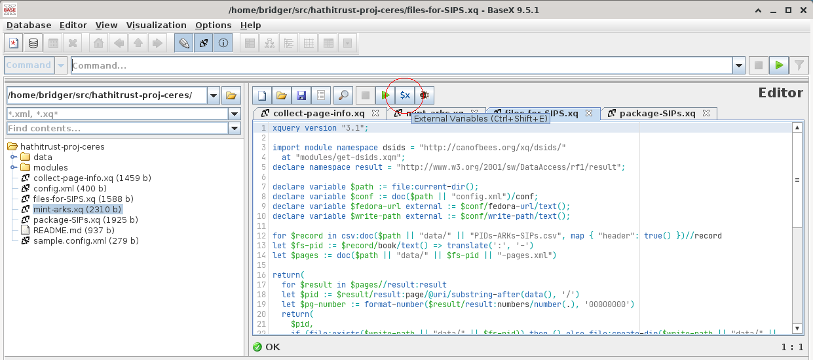
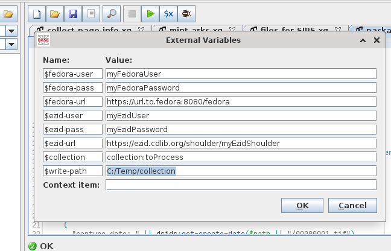

## Notes and Things: HathiTrust and Project Ceres ##

### How to use this repository ###
This repository contains a set of XQuery scripts for querying, acquiring, and packaging Fedora book OBJs for HathiTrust. These scripts do ***not*** cover validation; HathiTrust provides a [validation utility](https://github.com/hathitrust/ht_sip_validator) that can be installed and used to verify the output.

#### Requirements ####
* Java (minimally ver. 8)
* [BaseX](https://basex.org) ([downloads available here](https://files.basex.org/releases/9.5.2/BaseX952.zip))

#### Installation ####
After downloading and extracting the BaseX zip archive, clone this repository into the `$basex/src/` directory.

#### Configuration ####
These scripts can be run from the BaseX GUI (launched with `$basex/bin/basexgui` (`basexgui.bat` if on Windows)), or from the command line (launched with `$basex/bin/basex` (`basex` if on Windows)).

##### GUI #####
The following variables are required for executing these scripts
```
fedora-user
fedora-pass
fedora-url
ezid-user
ezid-pass
ezid-url
collection
write-path
```
and can be added in the GUI under the "External Variables" dialog window.



##### Command Line #####
The scripts can also be run from the command line; simply copy `sample.config.xml` to `config.xml` and update the values appropriately.

#### Running ####
Run the scripts in the following order:
1. `collect-page-info.xq`
2. `mint-arks.xq`
3. `files-for-SIPS.xq`
4. `package-SIPs.xq`
